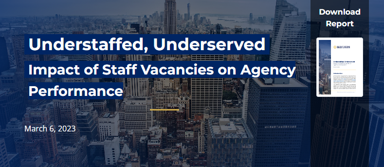

# Understaffed, Underserved: Impact of Staff Vacancies on Agency Performance

Employee retention and recruitment for City agencies continue to be areas of concern as the City of New York engages in the annual cycle of setting the City’s financial priorities. 

As a follow-up to December’s report, [Title Vacant](https://comptroller.nyc.gov/reports/title-vacant/), the Comptroller’s Office compared staff vacancies as of October 2022 to the [Preliminary Mayor’s Management Report](https://www.nyc.gov/site/operations/performance/mmr.page) (MMR) released in January 2023, which provides a snapshot of the City’s performance on metrics related to its agencies’ core missions.

Read the full report [here](https://comptroller.nyc.gov/reports/understaffed-underserved/).

Complete results (performance by agency and unit of appropriation) are available in [Final Data](Final%20Data). 

Detailed methodology is listed below and analysis code is included in this repo.

### Data

###### The [Mayor’s Management Report](https://dmmr.nyc.gov/) (MMR) 
This report presents performance indicators across city agencies. These data are published by the Mayor's Office of Operations on [NYC OpenData](https://data.cityofnewyork.us/City-Government/Mayor-s-Management-Report-Agency-Performance-Indic/rbed-zzin).

* Of 5,395 indicators, 508 indicators are classified as ‘Critical’ by agencies
    - Most, but not all indicators have a ‘Desired direction’, i.e. up is good news, or up is bad news.
    - Indicators are of various types (e.g. counts, percentages, rates, time spans).
    - Some indicators are cumulative through the year, some are not (see detail on that below).
    - Indicators are posted with varying frequencies. (e.g. monthly, quarterly, twice-a-year.) We found data were most consistently available in YTD values in Oct. and June.
* For this analysis, we filtered indicators to those that:
    - had valid data for October 2022;
    - have a labeled Desired Direction; and
    - were identifiably associated with an agency for which we had employment data.
* These parameters narrowed the scope to 975 indicators, of which 279 were Critical Indicators.

###### Staff vacancies

* Vacancies across city agencies were studied in-depth for the prior [Title Vacant](https://comptroller.nyc.gov/reports/title-vacant/) report.
* Summary data on vacancy rates by agency and Unit of Appropriation are included in the [Raw Data](Raw%20Data) folder for convenience.

###### Matching Units of Appropriation with Services

* Each indicator in the MMR is listed a measure of a broader ‘Service’. (For instance, the indicator “Average days between electrical inspection request and inspection” measures the Department of Building’s Service of “Facilitat\[ing] safe and compliant development”).
* Policy staff in the Comptroller’s Office identified the appropriate Unit of Appropriation (U/A) that best matches each Service.
* These matching U/As and Services are included in the [Raw Data](Raw%20Data) folder.
* This bespoke crosswalk would need to be updated in the future if additional Services are added to the MMR or U/As are added or changed. 

### Methodology

We narrowed the focus to MMR indicators that had valid data for October 2022, a Desired Direction, and were identifiably associated with an agency for which we had employment data.

We measure agency success in three ways: 

* whether the projected performance surpasses the goal this year;
* whether the performance is improved compared to FY22; and
* whether performance is improved compared to the average performance over the last five years.

We compute the percentage of critical indicators that are successful across each agency and the percentage all indicators that are successful across each unit of appropriation.

Each indicators is joined with the relevant U/A and its staff vacancy rate. Performance and vacancy rates are summarized by agency and by U/A.

This is processed in `MMR Evaluation.R`

We estimated the full-year FY23 performance to compare with prior years. For cumulative indicators, we projected the full-year level by scaling the reported Oct. 2022 value by the portion of that indicator’s full-year value which was typically achieved by October in prior years. This was done both for indicators marked as additive in MMR data and others where the pattern of prior year data showed they were logged cumulatively. For rate-type indicators not logged cumulatively, we treat the Oct. 2022 value as an estimate for FY23 full-year value. 
   
* The scaling is computed with `get_scale_from_oct_to_full_year.py`, which reads in manual corrections to the source data stored in `processed data/reset Additive.csv` and `processed data/add scaler.csv`.
* 

    
Expand for additional guidance to anyone repeating this analysis

    
    - To use the scaling we computed for Oct 2022 values, you can skip this step and proceed, using the scales stored in `processed data/scale Oct value to full-year value.csv`.
    - To repeat this overall analysis when full-year indicators are available, you can skip the steps for projecting full-year data. `processed data/scale Oct value to full-year value.csv` could be set to empty values.
    - To repeat this analysis in future years, forecasting from partial-year values, you’ll want to double check which indicators are cumulative and adjust `reset Additive.csv` and  `add scaler.csv` to make any corrections. Identifying which indicators are cumulative for the year was no small feat because of inconsistencies in the source data. See this [more detailed explanation](Notes/how%20to%20find%20cumulative%20indicators.md) of this process.
      

### Contact

This analysis was prepared by the Data Analysis team in the Policy Bureau of the Office of NYC Office of Comptroller Brad Lander.

Contact Dan Levine at dlevine at comptroller.nyc.gov or Robert Callahan at rcallah at 
comptroller.nyc.gov
